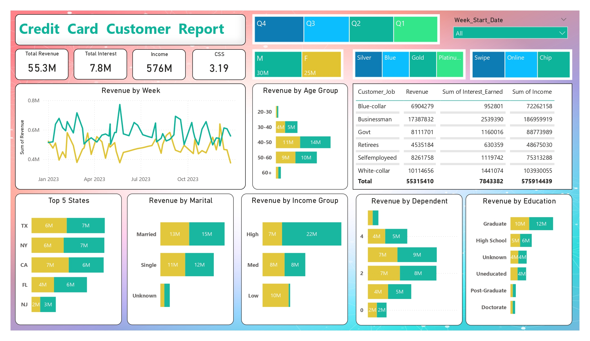
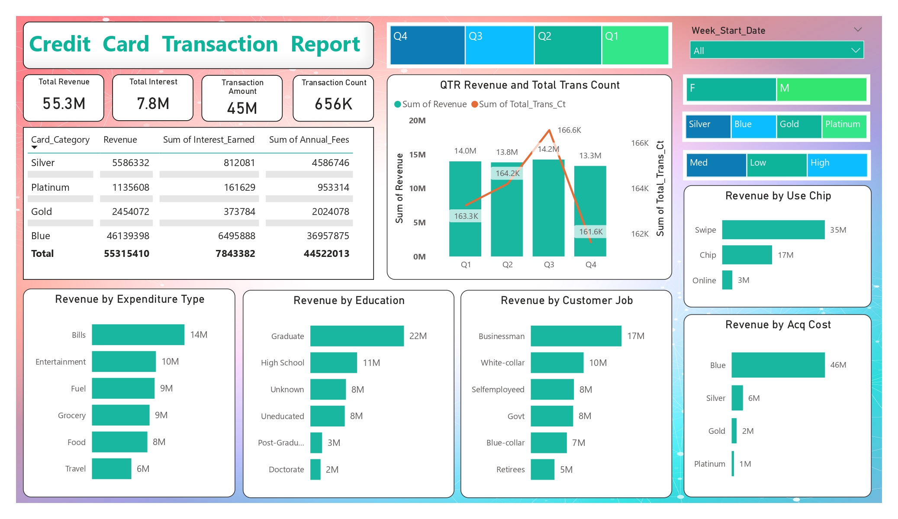

# 💳 Credit Card Analytics Dashboard (Power BI)
📌 Project Overview

This project presents an interactive Credit Card Analytics Dashboard built using Power BI, providing deep insights into customer behavior, transaction trends, and revenue performance.

The dashboard is divided into two main sections:

Customer Report
Transaction Report

It helps stakeholders understand revenue drivers, customer segmentation, and spending patterns.
# 📊 Dashboard Preview
🔹 Customer Report

🔹 Transaction Report

